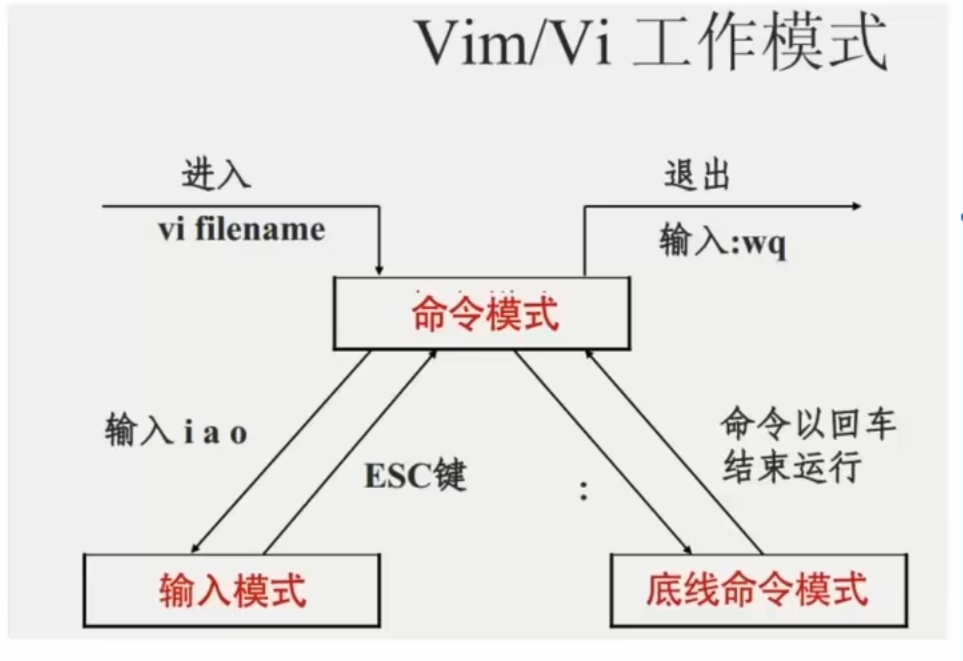

# VI/VIM编辑器

## 基本介绍

​	vi\wim是visual interface的简称，是Linux中的文本编辑器，和图形化界面中的文本编辑器一样，vi是命令行下对文本文件进行编辑的绝佳选择。

​	vim是vi的加强版本，不仅兼容vi的所有指令，不仅能编辑文本，而且还具有shell程序编辑的功能，可以不同颜色的字体来辨别语法的正确行，极大方便了程序的设计和编辑性。

## 工作模式

### 命令模式

在命令模式下，所敲的案件编辑器都理解为命令，以命令驱动执行不同的功能，此模式下不能自由进行文本编辑。

语法: vim 文件路径

- 若文件路径表示的文件不存在，那么此命令会用于编辑新文件
- 若文件路径表示的文件存在，那么此命令用于编辑已有的文件

命令模式下的一些常用快捷键：

| 模式     | 命令 | 描述                              |
| :------- | :--- | :-------------------------------- |
| 命令模式 | I    | 在当前光标位置进入输入模式        |
| 命令模式 | a    | 在当前光标位置之后进入输入模式    |
| 命令模式 | I    | 在当前行的开头，进入输入模式      |
| 命令模式 | A    | 在当前行的结尾，进入输入模式      |
| 命令模式 | b    | 在当前光标下一行进入输入模式      |
| 命令模式 | 0    | 在当前光标上一行进入输入模式      |
| 输入模式 | esc  | 任何情况下输入esc都能回到命令模式 |

| 模式     | 命令           | 描述                   |
| :------- | :------------- | :--------------------- |
| 命令模式 | g              | 移动光标到当前行的开头 |
| 命令模式 | $              | 移动光标到当前行的结尾 |
| 命令模式 | pageup(PgUp)   | 向上翻页               |
| 命令模式 | pagedown(PgDn) | 向下翻页               |
| 命令模式 | /              | 进入搜索模式           |
| 命令模式 | n              | 向下继续搜索           |
| 命令模式 | N              | 向上继续搜索           |

| 模式     | 命令     | 描述                             |
| :------- | :------- | :------------------------------- |
| 命令模式 | dd       | 删除光标所在行的内容             |
| 命令模式 | ndd      | n为数字，表示删除当前光标向下n行 |
| 命令模式 | yy       | 复制当前行                       |
| 命令模式 | nyy      | n为数字，复制当前行和下面的n行   |
| 命令模式 | p        | 粘贴复制的内容                   |
| 命令模式 | u        | 撤销修改                         |
| 命令模式 | ctrl + r | 反向撤销修改（重做）             |
| 命令模式 | gg       | 跳到首行                         |
| 命令模式 | G        | 跳到最后一行（行尾）             |
| 命令模式 | dG       | 从当前行开始，向下全部删除       |
| 命令模式 | dgg      | 从当前行开始，向上全部删除       |
| 命令模式 | d$       | 从当前光标开始，删除到本行的结尾 |
| 命令模式 | d0       | 从当前光标开始，删除到本行的开头 |

### 输入模式

即所谓的编辑模式，插入模式。在该模式下，可以对文件内容进行自由编辑

### 底线命令模式

以：开始，通常用于文件的保存，退出。

| 模式         | 命令       | 描述         |
| :----------- | :--------- | :----------- |
| 底线命令模式 | :wq        | 保存并退出   |
| 底线命令模式 | :q         | 仅退出       |
| 底线命令模式 | :q!        | 强制退出     |
| 底线命令模式 | :w         | 仅保存       |
| 底线命令模式 | :set nu    | 显示行号     |
| 底线命令模式 | :set paste | 设置粘贴模式 |

### 三种模式的互相转换：

