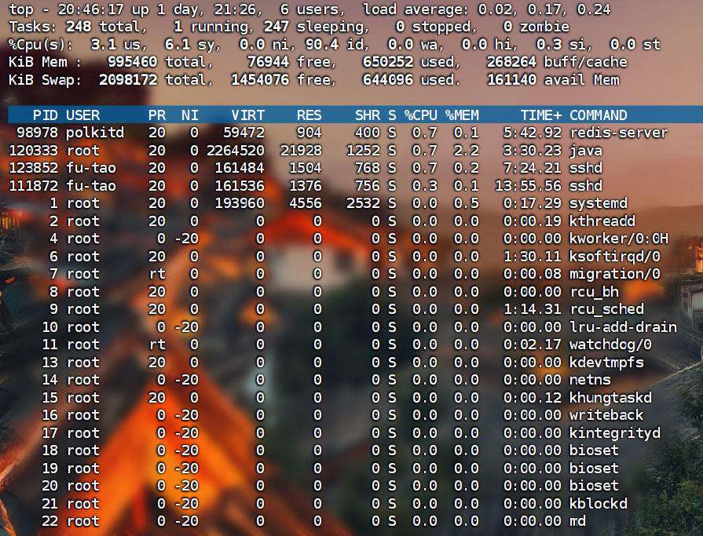

# 实时监控系统CPU和内存

```
top
```



**显示信息：**

- CPU使用率（us, sy, id, wa 等）
- 内存使用（总量、已用、空闲、缓存）
- 进程列表（CPU、内存占用排序）
- 系统运行时间和负载平均值

**交互命令：**

- `q`：退出
- `1`：显示每个CPU核心的详细使用情况
- `M`：按内存使用排序
- `P`：按CPU使用排序
- `k`：结束进程
