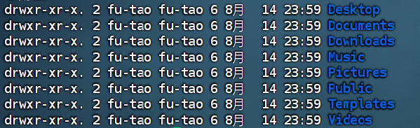
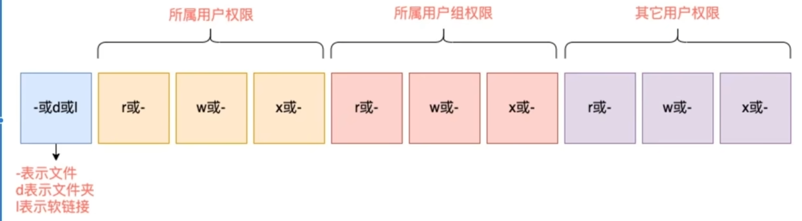

# 权限管理

## 权限控制的基本信息

通过ls -l可以以列表形式查看内容，并显示权限细节

​				序列1		序列2		序列3

- 序列1，表示文件、文件夹的权限控制信息
- 序列2,表示文件、文件夹所属用户
- 序列3，表示文件、文件夹所属用户组

权限分析：

举例：d rwx r-x r-x(drwxr-xr-x)表示：(r:读 w:写,x：执行)

- 这是一个文件夹，首字母d表示
- 所属用户的权限是：有r有w有x,rwx]
- 所属用户组的权限是：有r无w有x,r-x(-表示没有此权限)
- 其他用户的权限是：有r无w有x,r-x

其中,r:代表读权限，w:代表写权限，x:表示执行权限

针对于文件，文件夹的不同，rwx的含义有细微的差别

- r,针对文件可以查看文件内容
  - 针对文件夹，可以查看文件夹内容，如ls命令
- w,针对文件表示可以修改此文件
  - 针对文件夹，可以在问价夹内，创建、删除、改名等操作
- x,针对文件表示可以将文件作为程序执行
  - 针对文件夹，表示可以更改工作目录到文件夹，即cd进入

## 修改权限控制`chmod`命令

**chmod命令可以修改文件、文件夹的权限信息**

ps:只有文件、文件夹所属用户或root用户可以修改

语法：chmod [-R] 权限 文件或文件夹

- 选项：-R，对文件夹内的全部内容应用同样的操作

示例：

- chmod u=rwx,g=rx,o=x hello.txt,将文件权限修改为：rwxr-x--x
  - 其中：u表示user所属用户权限，g表示group组权限，o表示other其他用户权限

- chmod -R u=rwx,g=rx,o=x text,将文件夹test以及文件夹全部内容权限设置为：rwxr-x--x

快捷写法：chmod 751 hello.txt

将hello.txt的权限修改为751权限

**权限数字序列：**

| 数字表示 | 权限符号表示 | 描述           |
| :------- | :----------- | :------------- |
| 0        | ---          | 无任何权限     |
| 1        | --x          | 仅有执行权限   |
| 2        | -w-          | 仅有写权限     |
| 3        | -wx          | 有写和执行权限 |
| 4        | r--          | 仅有读权限     |
| 5        | r-x          | 有读和执行权限 |
| 6        | rw-          | 有读和写权限   |
| 7        | rwx          | 有全部权限     |

751表示的权限是rwx(7)r-x(5)--r(1)

## 修改权限控制`chown`命令

使用chown修改文件、文件夹所属用户、用户组

**普通用户无法修改所属为其他用户或组，所以该命令只使用与root用户执行**

语法：chown [-R] [用户] [ : ] [用户组] 文件或文件夹

- 选项，用户，修改所属用户
- 选项，用户组，修改所属用户组
- :用于分隔用户和用户组

示例：

| 命令示例                       | 功能描述                                                     |
| :----------------------------- | :----------------------------------------------------------- |
| `chown root hello.txt`         | 将文件`hello.txt`的所属用户修改为`root`                      |
| `chown :root hello.txt`        | 将文件`hello.txt`的所属用户组修改为`root`                    |
| `chown root:itheima hello.txt` | 将文件`hello.txt`的所属用户修改为`root`，所属用户组修改为`itheima` |
| `chown -R root test`           | 将文件夹`test`及其内部所有内容的所属用户递归修改为`root`     |