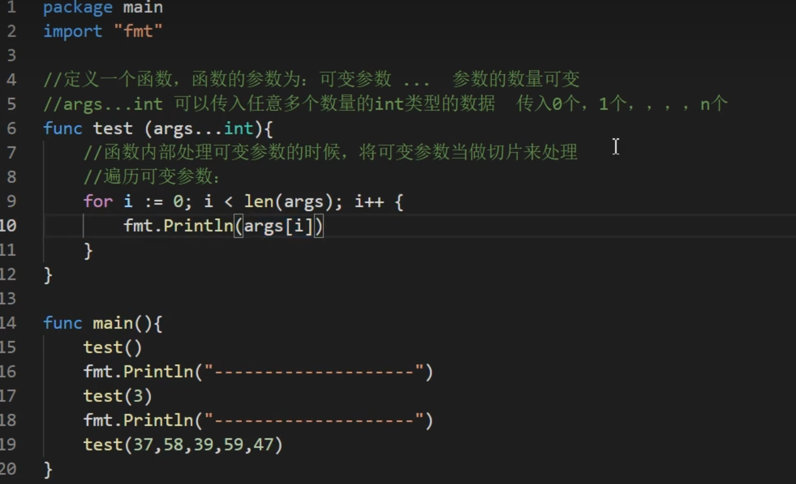
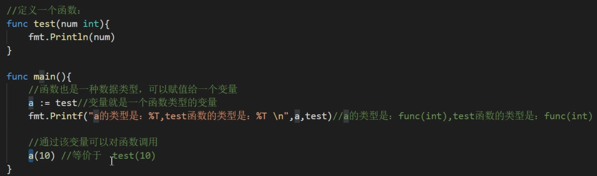
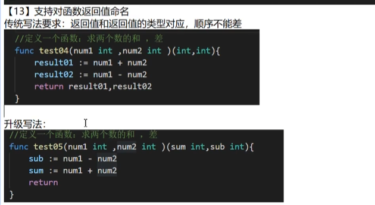

## 函数的结构
### 基本语法 
func 函数名（形参列表）（返回值类型列表）{
    执行语句.. 
    return + 返回值列表
}
>如果返回值类型就一个的话，那么()是可以省略不写的
>函数中形参的定义是**名称在前,类型在后**
```go
func Sum (num1 int,num2 int)(int){
	var numble int = 0
	numble = num1 + num2
	return numble
}
```
>如果没有返回值，那么返回值类型则直接不用写就行
>有多个返回值的情况如下
```go
func Sum1 (num1 int,num2 int)(int,int){
	var numble int = 0
	numble = num1 + num2
	result := num1-num2
	return numble,result
}
```
>有多个返回值的情况下，若只想得到其中的部分返回值，则可以``使用 `_` 代替``用于忽略那个值

==注意==:在go语言中不存在函数重载的情况
- 往形参列表中传入的参数数量是可变的

- 基本数据类型和数组默认都是值传递的，即进行值拷贝。在函数内修改，不会影响到原来的值。
- 以值传递方式的数据类型,如果希望在函数内的变量能修改函数外的变量,可以传入变量的地址&,函数内以指针的方式操作变量。从效里来看类似引用传递。
>函数可以作为一种数据类型赋值给变量，赋值后的变量可以直接当做该函数使用


>
