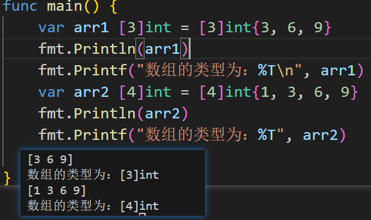

1. ### 长度也属于类型的一个部分，例如：
>arr1 [3]int和arr2 [4]int 不是同一个类型

2. ### Go中的数组属值类型，在默认的情况下是值传递，因此会进行值拷贝
>在这种情况下传递过去的数组值，不会被改变

3. ## 如果想要数组中的值发生改变可以使用指针的形式，将数组的地址进行传递
```go
package main

import "fmt"

func main() {
	
	var arr3 [3]int = [3]int{3, 6, 9}
	test(&arr3)
	fmt.Println(arr3)
}
func test(arr *[3]int) {
	arr[0] = 7
}

```