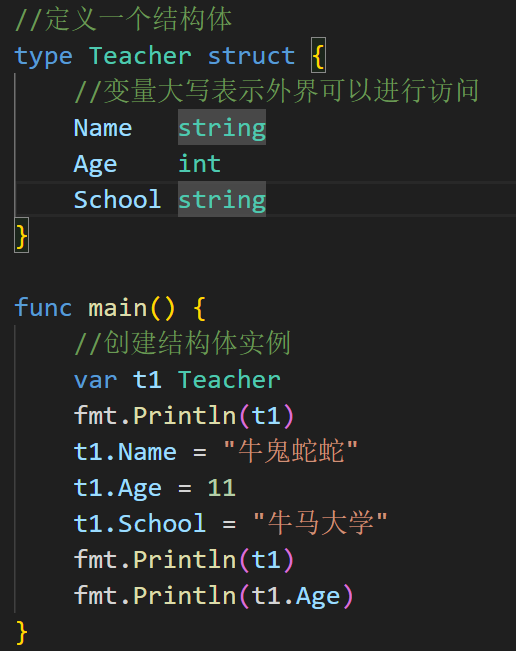

1. 方式一:直接创建


2. 方式二:
```go
//方式二
func main() {
	//创建结构体实例
	var t Teacher = Teacher{"牛鬼蛇蛇",11,"牛马大学"}
	fmt.Println(t)
	fmt.Println(t.Age)
}

```

3. 方式三：返回的是结构体的指针
```go
func main() {
	//创建结构体实例
	var t *Teacher = new(Teacher)
	(*t).Name = "风鹰侠"
	(*t).Age = 18
	t.School = "铠甲大学"
	//为了符合程序员的编程习惯，go提供了简化的赋值方式：
	fmt.Println(*t) //底层逻辑对其进行转化成指针的方式
}

```
4. 方式四：
```go
func main() {
	//创建结构体实例
	var t *Teacher = &Teacher{"牛鬼蛇蛇", 11, "牛马大学"}
	fmt.Println(*t) //底层逻辑对其进行转化成指针的方式
}

```