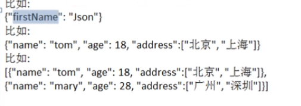
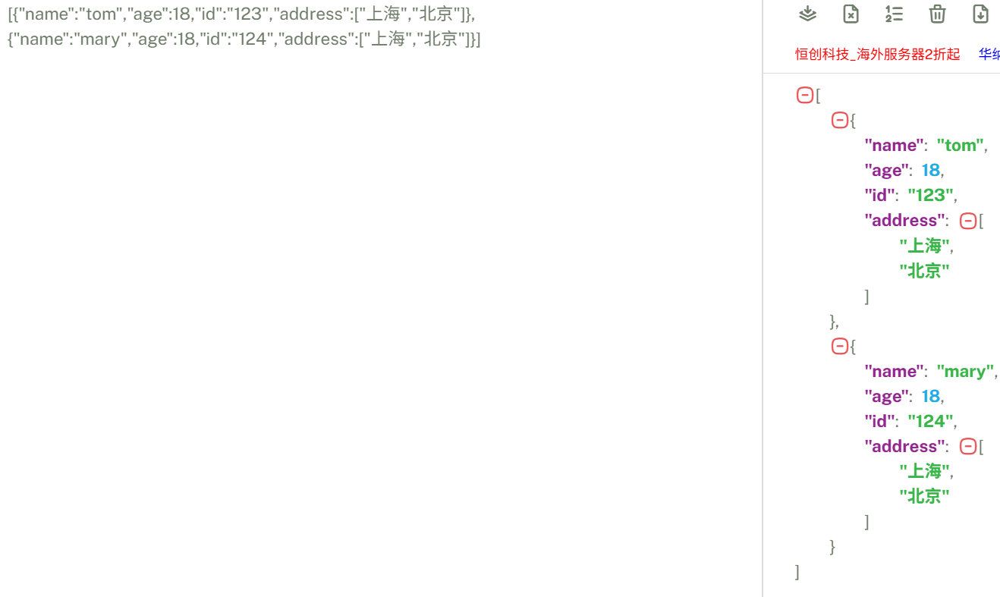

# `json`数据格式说明

在JS语言中，一切都是对象，因此，任何的数据类型都可以通过JSON来表示，例如字符串、数字、对象、数组、map、结构体等

JSON键值对是用来保存，数据一种方式，键、值对组合中的键名写在前面并用双引号`""`包裹，使用冒号`:`分割，然后紧接着值



```json
{"k1":"v1","k2":"v2","k3":"v3","k4":"[v4,v5]"}

[{"k1":"v1","k2":"v2","k3":"v3","k4":"[v4,v5]"},
{"k1":"v1","k2":"v2","k3":"v3","k4":"[v4,v5]"}]
```

> https://www.json.cn/这个网站可以验证JSON数据是否正确


