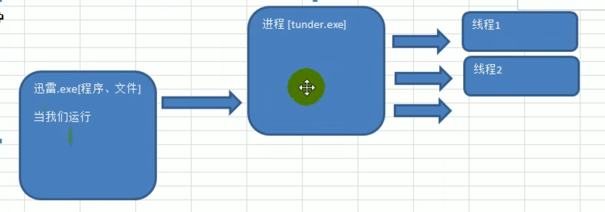
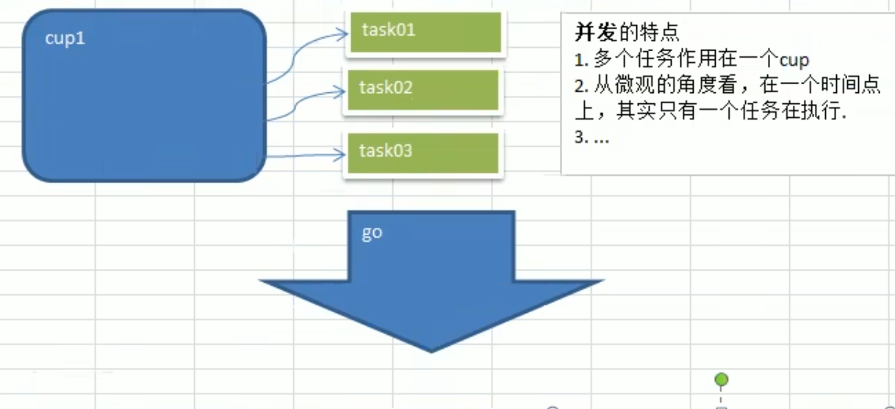
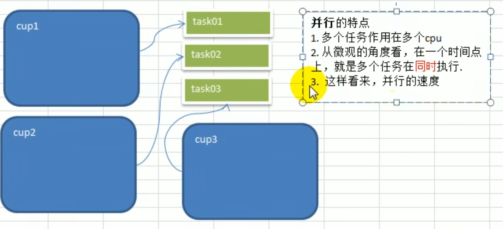
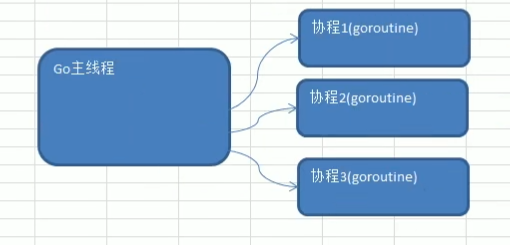

# 引出goroutine

实现统计1-9000000000的数字中，哪些是素数？

1. 传统的方法，就是使用一个循环，循环的判断各个数是不是常数？(时间复杂度大)
2. 使用并发或者并行的方式，将统计素数的任务分配给多个goroutine去完成，这时就会使用到goroutine（运行速度变快）

# goroutine基本介绍

## 1.进程和线程的说明

1. 进程就是程序程序在操作系统中的一次执行过程，是系统进行资源分配和调度的基本单位 
2. 线程是进程的一个执行实例,是程序执行的最小单元，它是比进程更小的能独立运行的基本单位。
3. 一个进程可以创建核销毁多个线程,同一个进程中的多个线程可以并发执行。
4.  一个程序至少有一个进程,一个进程至少有一个线程

**进程和线程的关系示意图**：

## 2. 并行和并发的说明

1. 多线程程序在单核上运行,就是并发

2. 多线程程序在多核上运行,就是并行 

3. 示意图 

   并发:因为是在一个cpu上,比如有10个线程,每个线程执行10毫秒(进行轮询操作),从人的角度看,好像这10个线程都在运行,但是从微观上看,在某一个时间点看,其实只有一个线程在执行,这就是并发。 

   并行:因为是在多个cpu上(比如有10个cpu),比如有10个线程,每个线程执行10毫秒(各自在不同cpu上执行),从人的角度看,这10个线程都在运行,但是从微观上看,在某一个时间点看,也同时有10个线程在执行,这就是并行 I 并行vs并发

## 3. Go协程和Go主线程

1. Go主线程(有程序员直接称为线程/也可以理解成进程):一个Go线程上,可以起多个协程,你可以这样理解,协程是轻量级的线程。

2.  Go协程的特点:

   - 有独立的栈空间

   - 共享程序堆空间 

   - 调度由用户控制 

   - 协程是轻量级的线程 

