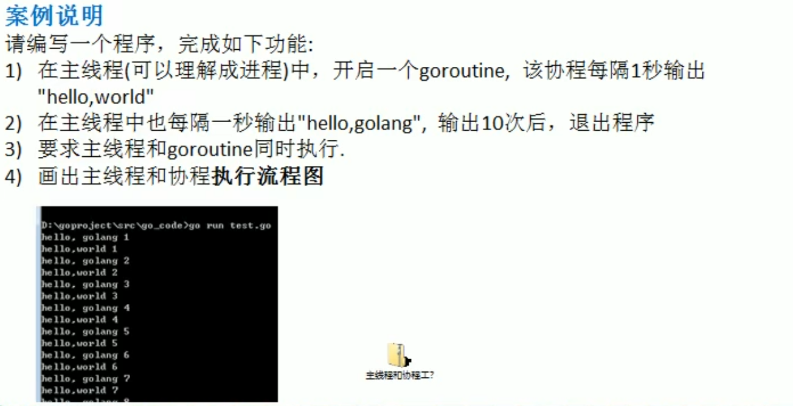
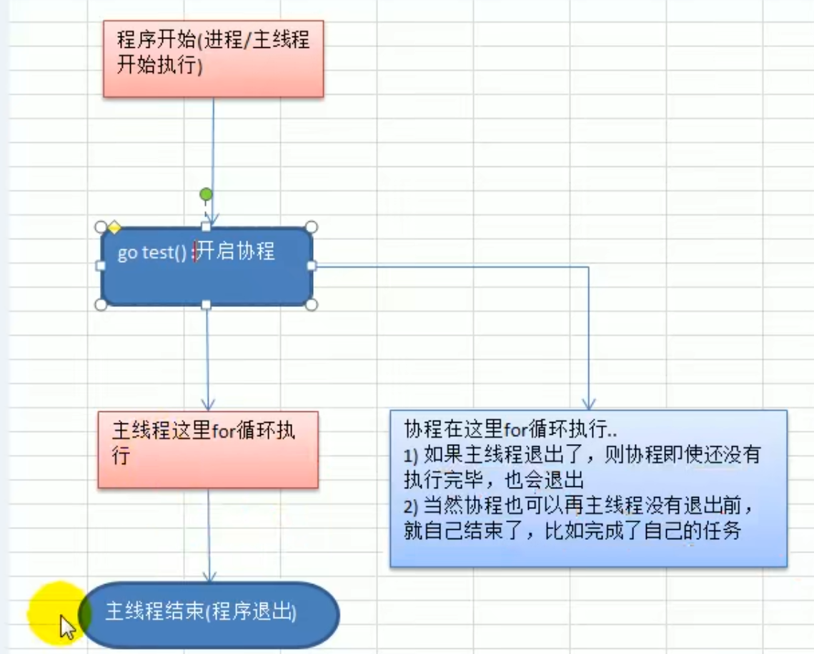

# 协程快速入门案例



代码实现：

```go
package main

import (
	"fmt"
	"strconv"
	"time"
)

// 编写一个函数，每隔一秒输出"hello world"
func test() {
	for i := 1; i <= 10; i++ {
		fmt.Println("test()hello world" + strconv.Itoa(i))
		time.Sleep(time.Second)
	}
}
func main() {
	go test() //开启一个协程
	for i := 1; i <= 10; i++ {
		fmt.Println("main()hello golang" + strconv.Itoa(i))
		time.Sleep(time.Second)
	}
}

```



1. 主线程是一个物理线程，直接作用在 cpu 上的。是重量级的，非常耗费 cpu 资源。
2. 协程从主线程开启的，是轻量级的线程，是逻辑态。对资源消耗相对小。
3. Golang 的协程机制是重要的特点，可以轻松的开启上万个协程。其它编程语言的并发机制是一般基于线程的，开启过多的线程，资源耗费大，这里就突显 Golang 在并发上的优势了