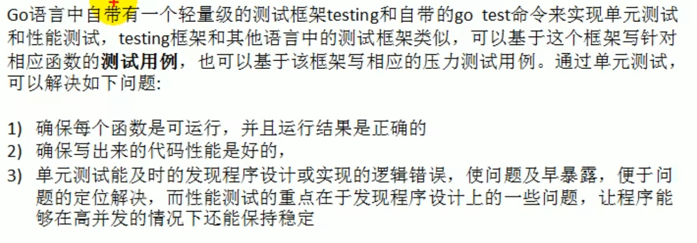
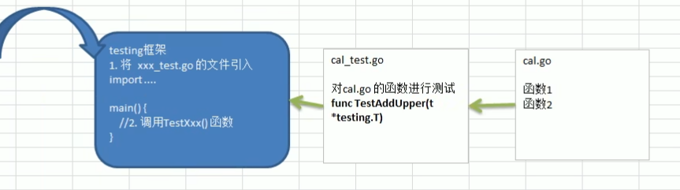
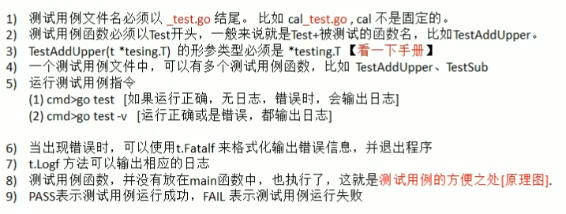
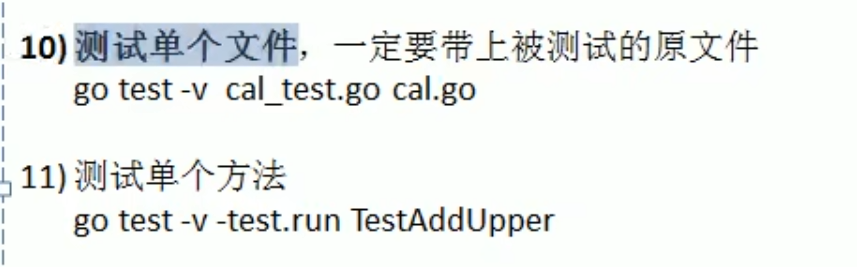

# 单元测试

## 传统的测试方法

例如下方，实现一个从1加到n的结果是多少并返回，检测是否和预期的值一样，来判断是否正确

```go
package main

import "fmt"

func addUpper(n int) int {
	res := 0
	for i := 1; i <= n; i++ {
		res += i
	}
	return res
}
func main() {
	res := addUpper(10)
	if res != 55 {
		fmt.Printf("addUpper错误，返回值=%v,期望值=%v\n", res, 55)
	} else {
		fmt.Printf("addUpper正确，返回值=%v,期望值=%v\n", res, 55)
	}
}

```

缺点：

1. 不方便，如果需要在main函数中调用，这样就需要去修改main函数，如果项目正在运行，就可能造成项目停止
2. 不利于管理，因为测试多个函数或者多个模块时，都需要写在main函数，不利于我们管理和思路


## 单元测试的基本介绍




## 单元测试，入门案例

`cal.go`文件中写入要测试的函数

```go
package main
func AddUpper(n int) int {
	res := 0
	for i := 1; i <= n; i++ {
		res += i
	}
	return res
}
func getSub(n1, n2 int) int {
	return n1 - n2
}
```

分别创建`cal_test.go`和`sub_test.go`来进行测试

`cal_test.go`

```go
package main
import (
	"fmt"
	"testing"
)
func TestAddUpper(t *testing.T) {
	res := AddUpper(10)
	if res != 55 {
		t.Fatalf("addUpper执行错误，期望值=%v,实际值=%v\n", 55, res)
	}
	t.Logf("addUpper执行正确")
}
func TestHello(t *testing.T) {
	fmt.Println("TestHello被调用")
}
```

`sub_test.go`

```go
package main
import (
	"testing"
)
func TestGetSub(t *testing.T) {
	res := getSub(15, 10)
	if res != 5 {
		t.Fatalf("getSub执行错误，期望值=%v,实际值=%v\n", 5, res)
	}
	t.Logf("getSub执行正确")
}
```

单元测试示意图




注意细节：





> 测试单个go test -v -run TestAddUpper

