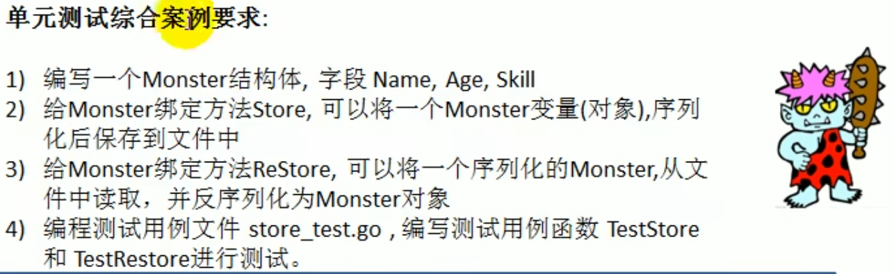

# 综合案例



monster.go部分：

```go
package main
import (
	"bufio"
	"encoding/json"
	"fmt"
	"io"
	"os"
)
type Monster struct {
	Name  string
	Age   int
	Skill string
}
func (m *Monster) Store() bool {
	data, err := json.Marshal(m)
	if err != nil {
		fmt.Printf("序列化失败,err=%v\n", err)
		return false
	}
	filePath := "e:/test.txt"
	file, err := os.OpenFile(filePath, os.O_WRONLY|os.O_APPEND, 0666)
	if err != nil {
		fmt.Println("open file error=", err)
	}
	defer file.Close()
	_, err = file.WriteString(string(data) + "\n")
	if err != nil {
		fmt.Printf("写入文件失败，err=%v\n", err)
	}
	//fmt.Println("写入文件成功")
	return true
}
func (m *Monster) ReStore() bool {
	filePath := "e:/test.txt"
	file, err := os.Open(filePath)
	if err != nil {
		fmt.Printf("打开文件失败，err=%v\n", err)
	}
	defer file.Close()
	reader := bufio.NewReader(file)
	var lastMonster Monster // 存储最后一行的数据
	for {
		str, err := reader.ReadString('\n')
		if err == io.EOF {
			if str != "" {
				if err := json.Unmarshal([]byte(str), &lastMonster); err != nil {
					fmt.Printf("反序列化失败, err=%v\n", err)
					return false
				}
			}
			fmt.Println(lastMonster)
			break
		}
		//var m Monster
		//err = json.Unmarshal([]byte(str), &m)
		if err != nil {
			fmt.Printf("反序列化失败,err=%v", err)
			return false
		}
		// 反序列化当前行到临时变量
		if err := json.Unmarshal([]byte(str), &lastMonster); err != nil {
			fmt.Printf("反序列化失败, err=%v\n", err)
			return false
		}
		//fmt.Printf("读取文件成功，获得的Monster为:%v\n", m)
	}
	*m = lastMonster
	return true
}
```

monster_test.go部分

```go
package main
import (
	"testing"
)
func TestStore(t *testing.T) {
	m1 := Monster{
		Name:  "牛马",
		Age:   24,
		Skill: "干活",
	}
	res := m1.Store()
	if !res {
		t.Fatalf("store执行错误，期望值；%v,实际值:%v", true, res)
	}
	t.Logf("store测试成功")
}
func TestReStore(t *testing.T) {
	var m = &Monster{}
	res := m.ReStore()
	if !res {
		t.Fatalf("restore执行错误，期望值；%v,实际值:%v", true, res)
	}
	if m.Name != "牛马" {
		t.Fatalf("restore执行错误，期望值；%v,实际值:%v", "牛马", m.Name)
	}
	t.Logf("restore测试成功")
}
```

