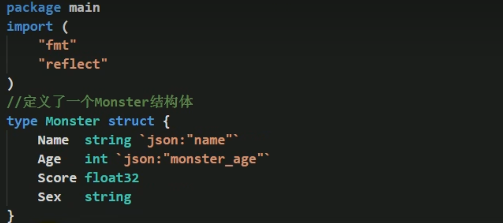
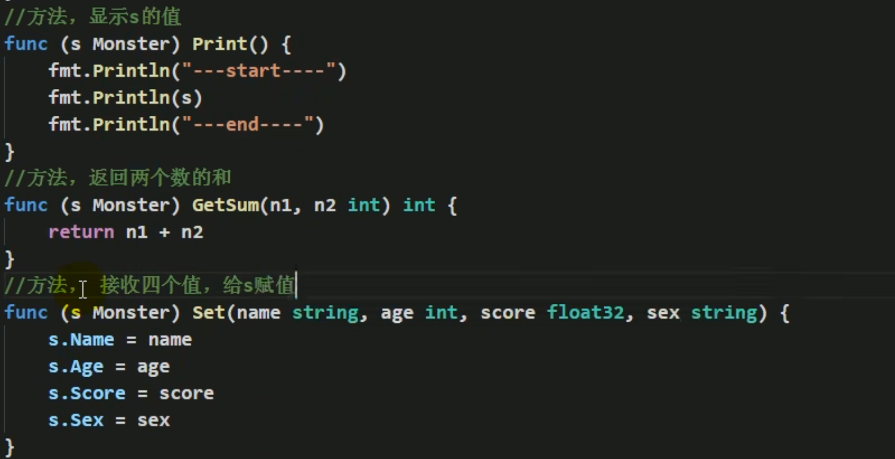
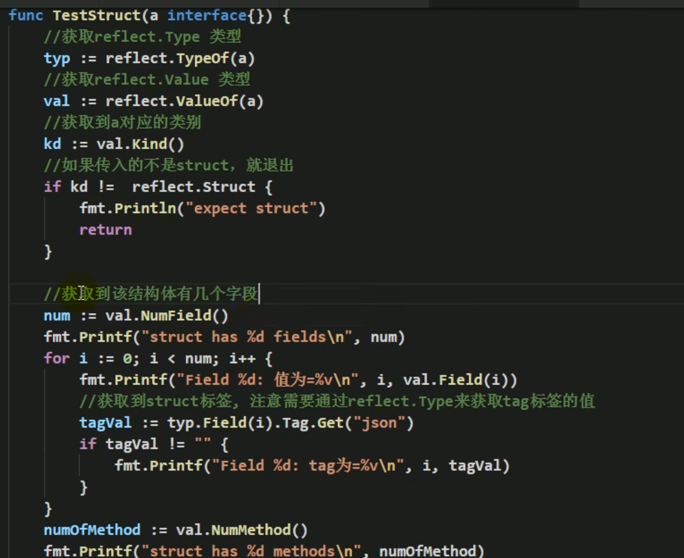
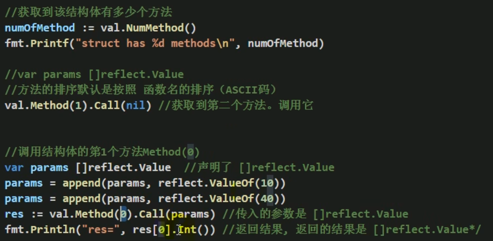
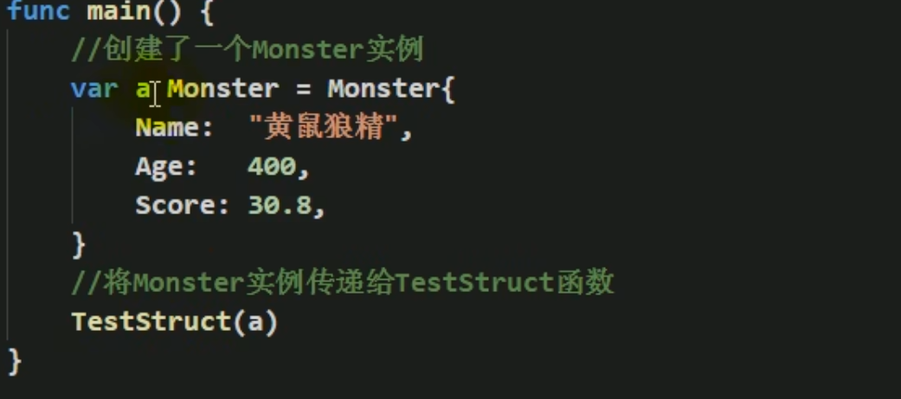
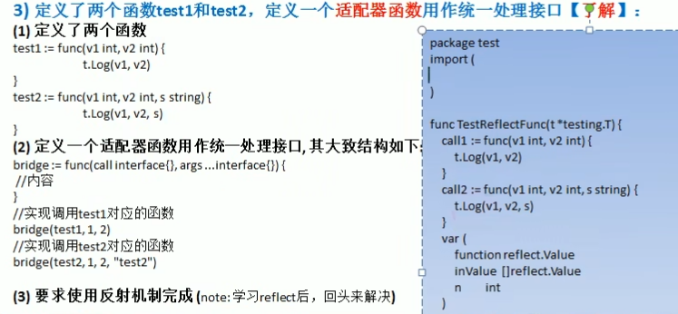
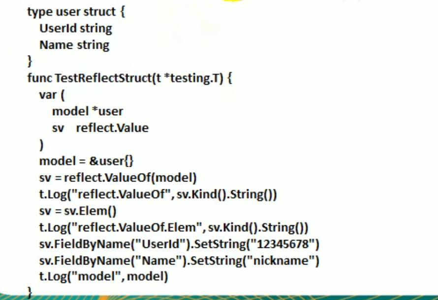
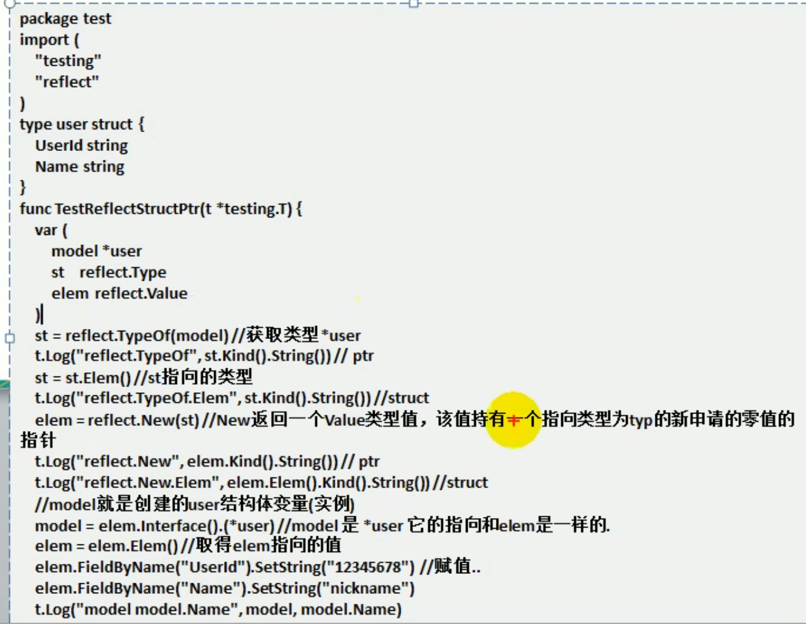
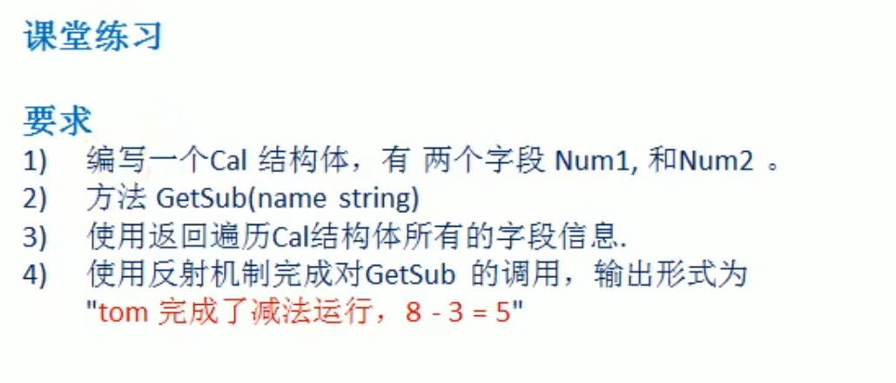

# 反射实例练习

1. 给你一个变量`var v float64 = 1.2`,请使用反射来的到它的`reflect.Value`,然后获取对应的Type,KInd和值，并将`reflect.Value`转换成interface{},再将interface{}转换成float64.

   ```go
   package main
   
   import (
   	"fmt"
   	"reflect"
   )
   
   func reflect01(b interface{}) {
   	rVal := reflect.ValueOf(b)
   
   	fmt.Printf("v Type=%T,v Kind=%v\n", rVal, rVal.Kind())
   
   	iR := rVal.Interface()
   	num := iR.(float64)
   	fmt.Printf("num type=%T,num=%v\n", num, num)
   }
   func main() {
   	var v float64 = 1.2
   	reflect01(v)
   }
   ```


# 反射的实践

1. 使用反射来遍历结构体的字段，调用结构体的方法，并获取结构体标签的值













2. 使用反射的方式来获取结构体的tag变迁，遍历字段的值，修改字段值，调用结构体方法（要求：通过传递地址方式完成，在前面案例上修改即可）


3. 

```go
package main

import (
	"reflect"
	"testing"
)

func TestReflectFunc(t *testing.T) {
	call1 := func(v1 int, v2 int) {
		t.Log(v1, v2)
	}
	call2 := func(v1 int, v2 int, s string) {
		t.Log(v1, v2, s)
	}

	var (
		function reflect.Value
		inValue  []reflect.Value
		n        int
	)

	bridge := func(call interface{}, args ...interface{}) {
		n = len(args)
		inValue = make([]reflect.Value, n)
		for i := 0; i < n; i++ {
			inValue[i] = reflect.ValueOf(args[i])
		}
		function = reflect.ValueOf(call)
		function.Call(inValue)
	}

	bridge(call1, 1, 2)
	bridge(call2, 1, 2, "test2")
}

```


4. 使用反射操作任意结构体类型

   


5. 使用反射创建并操作结构体

   


6. 练习

   

```go
package main
import (
	"fmt"
	"reflect"
)
type Cal struct {
	Num1 int
	Num2 int
}
func (c Cal) GetSub(name string) {
	res := c.Num1 - c.Num2
	fmt.Printf("%s 完成了减法运行，%d - %d = %d\n", name, c.Num1, c.Num1, res)
}
func main() {
	cal := Cal{Num1: 6, Num2: 3}

	//使用反射遍历Cal结构体所有字段信息
	tCal := reflect.TypeOf(cal)
	rCal := reflect.ValueOf(cal)
	for i := 0; i < tCal.NumField(); i++ {
		filed := tCal.Field(i)
		value := rCal.Field(i)
		fmt.Printf("字段名:%s,字段类型：%s,字段值：%v\n", filed.Name, filed.Type, value)

	}

	//使用反射机制调用GetSub方法
	methon := reflect.ValueOf(cal).MethodByName("GetSub")
	if methon.IsValid() {
		args := []reflect.Value{reflect.ValueOf("tom")}
		methon.Call(args)
	}

}
```

