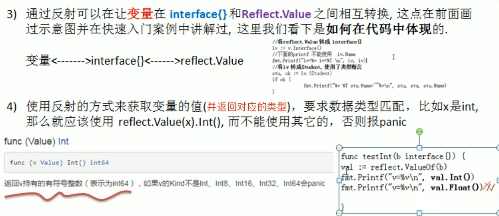

# 反射注意事项和细节

 1. `reflect.Value.Kind`，获取变量的类别，返回的是一个常量

2. Type和Kind的区别 

    Type 是类型， Kind 是类别， Type 和 Kind 可能是相同的，也可能是不同的.

   比如：var num int = 10 num 的 Type 是 int，Kind 也是 int 

   比如： var stu Student stu 的 Type 是 pkg1.Student, Kind 是 struct



5. 通过反射来修改变量，注意当使用SetXxx方法来设置需要通过对应的指针类型来完成，这样才能改变传入的变量的值，同时需要使用到reflect.Value.Elem()方法

   ```go
   package main
   
   import (
   	"fmt"
   	"reflect"
   )
   
   // 专门演示反射改变传入值
   func reflectTest01(b interface{}) {
   	//获取reflect.Value
   	rVal := reflect.ValueOf(b)
   	fmt.Printf("rVal type=%v\n", rVal.Kind())
   	rVal.Elem().SetInt(20)
   }
   func main() {
   	//编写一个案例，演示对（基本数据类型，`interface{}`,`reflect.Value`）进行反射的基本操作
   	var num int = 100
   	reflectTest01(&num)
   	fmt.Printf("num=%v\n", num)
   }
   
   ```

   

6. 如何理解reflect.Value.Elem():

   
