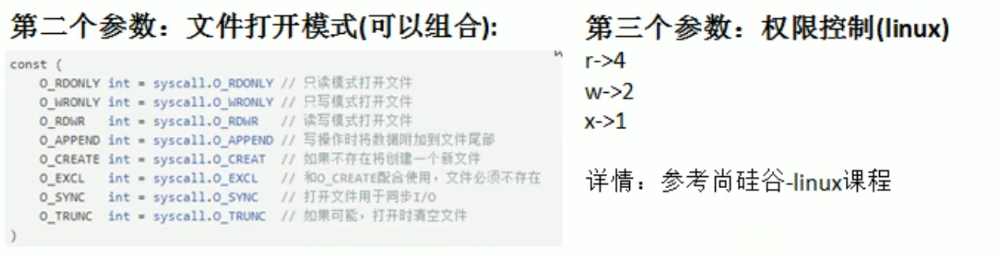

# 写文件操作

## 基本介绍

```go
func OpenFile(name string,flag int,perm FileMpde)(file *File,err error)
```

说明: `os.OpenFile`是一个更一般性的文件打开函数,它会使用指定的选项(如 O_RDONLY等)、指定的模式(如0666等)打开指定名称的文件。如果操作成功, 回的文件对象可用于1/0,如果出错,错误底层类型是*PathError.




## 基本应用实例

使用`os.OpenFile(),bufio.NewWriter() ,*Wirter`的方法`WriterString`完成下面的例子

1. 方式一：

   创建一个新文件，写入内容：5句"Hello World"

   ```go
   package main
   import (
   	"bufio"
   	"fmt"
   	"os"
   )
   func main() {
   	filePath := "e:/test01.txt"
   	file, err := os.OpenFile(filePath, os.O_WRONLY|os.O_CREATE, 0)
   	if err != nil {
   		fmt.Println("打开文件错误")
   		return
   	}
   	defer file.Close()
   
   	//准备写入
   	str := "Hello Golang\n"
   	//写入时，使用带缓存的*writer
   	writer := bufio.NewWriter(file)
   	for i := 0; i < 5; i++ {
   		writer.WriteString(str)
   	}
   	//writer是带缓存的，因此在调用WriterString方法时
   	//内容是先写入缓存的，所以要用Flush()将缓存的数据写入文件中
   	err1 := writer.Flush()
   	if err1 != nil {
   		return
   	}
   	fmt.Println("文件写入成功")
   
   }
   ```

2. 打开一个存在的文件中，将圆的内容覆盖成新的内容10句‘’你好，北京‘’

   ```go
   package main
   import (
   	"bufio"
   	"fmt"
   	"os"
   )
   func main() {
   	//打开一个存在的文件
   	filePath := "e:/test01.txt"
   	file, err := os.OpenFile(filePath, os.O_WRONLY|os.O_TRUNC, 0666)
   	if err != nil {
   		fmt.Printf("open file err=%v\n", err)
   		return
   	}
   	defer file.Close()
   
   	//准备写入
   	str := "你好，北京\n"
   	//写入时，使用带缓存的*writer
   	writer := bufio.NewWriter(file)
   	for i := 0; i < 10; i++ {
   		writer.WriteString(str)
   	}
   	//writer是带缓存的，因此在调用WriterString方法时
   	//内容是先写入缓存的，所以要用Flush()将缓存的数据写入文件中
   	err1 := writer.Flush()
   	if err1 != nil {
   		return
   	}
   	fmt.Println("文件写入成功")
   
   }
   
   ```

3. 打开一个存在的文件，在原来的基础上追加内容`ABC!ENGLISH`

   ```go
   file, err := os.OpenFile(filePath, os.O_WRONLY|os.O_APPEND, 0666)
   str := "ABC!ENGLISH\n"
   ```

   在第二的代码上修改这两句代码，得以实现

4. 打开一个存在的文件，将原来的内容独处显示在终端，并且追加5句"hello,北京"

   ```go
   package main
   import (
   	"bufio"
   	"fmt"
   	"os"
   )
   func main() {
   	//打开一个存在的文件
   	filePath := "e:/test01.txt"
   	file, err := os.OpenFile(filePath, os.O_RDWR|os.O_APPEND, 0666)
   	if err != nil {
   		fmt.Printf("open file err=%v\n", err)
   		return
   	}
   	defer file.Close()
   	//准备写入
   	str := "hello,北京\n"
   	//写入时，使用带缓存的*writer
   	writer := bufio.NewWriter(file)
   	for i := 0; i < 5; i++ {
   		writer.WriteString(str)
   	}
   	//writer是带缓存的，因此在调用WriterString方法时
   	//内容是先写入缓存的，所以要用Flush()将缓存的数据写入文件中
   	err1 := writer.Flush()
   	if err1 != nil {
   		return
   	}
   	fmt.Println("文件写入成功")
   
   	read, err2 := os.ReadFile(filePath)
   	if err2 != nil {
   		fmt.Printf("read file error=%v", err2)
   	}
   	fmt.Printf("%v", string(read))
   }
   
   ```


5. 编写一个程序吗，将一个文件的内容，写入另一个文件。注:这两个文件已经存在

   使用`os.ReadFile os.WirteFile`完成写文件的任务

   ```go
   package main
   
   import (
   	"fmt"
   	"os"
   )
   func main() {
   	//e:/test01.txt文件内容导入到e:/kkk.txt
   	//首先e:/test01.txt内容读取到内存中，将读取到的内容写入e:/kkk.txt中
   	file1Path := "e:/test01.txt"
   	file2Path := "e:/kkk.txt"
   	data, err := os.ReadFile(file1Path)
   	if err != nil {
   		fmt.Printf("read file err=%v\n", err)
   	}
   
   	err = os.WriteFile(file2Path, data, 0666)
   	if err != nil {
   		fmt.Printf("write file error=%v\n", err)
   	}
   }
   ```
   
   