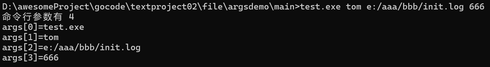
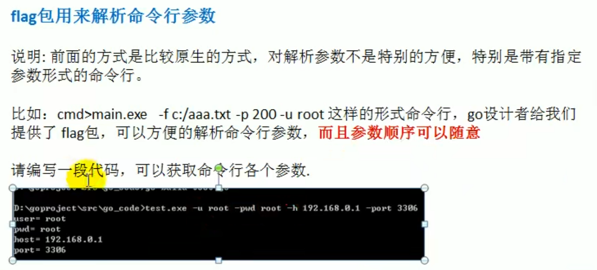
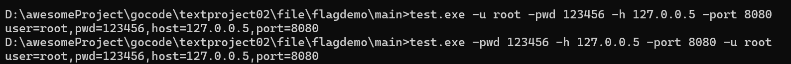

# 命令行参数

## `os.Args`是一个string 的切片，用来存储所有的命令行参数



代码部分

```go
package main
import (
	"fmt"
	"os"
)
func main() {
	fmt.Println("命令行参数有", len(os.Args))
	//遍历os.Args切片，就可以得到所有的命令行输入的参数值
	for i, v := range os.Args {
		fmt.Printf("args[%v]=%v\n", i, v)
	}
}
```

## flag包用来解析命令行参数



代码实现

```go
package main

import (
	"flag"
	"fmt"
)

func main() {
	//定义几个变量，用于接受命令行的参数值
	var user string
	var pwd string
	var host string
	var port int
	flag.StringVar(&user, "u", "", "用户名，默认为空")
	flag.StringVar(&pwd, "pwd", "", "密码，默认为空")
	flag.StringVar(&host, "h", "localhost", "主机名，默认为localhost")
	flag.IntVar(&port, "port", 3306, "端口号，默认为3306")
	//进行一个重要的转换操作，必须调用该方法
	flag.Parse()

	//输出
	fmt.Printf("user=%v,pwd=%v,host=%v,port=%v", user, pwd, host, port)
}

```

