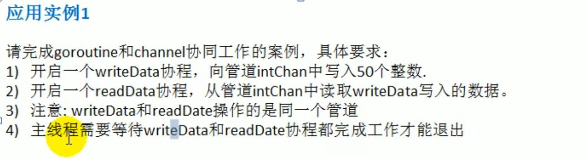
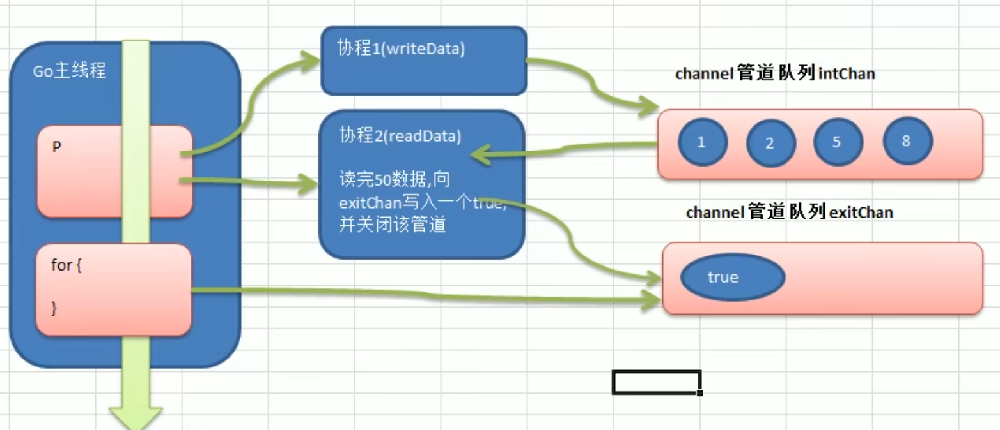
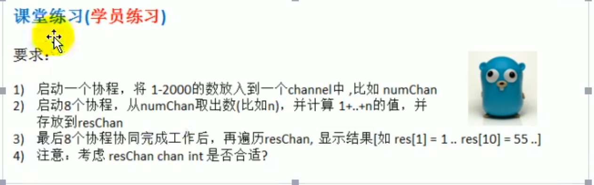
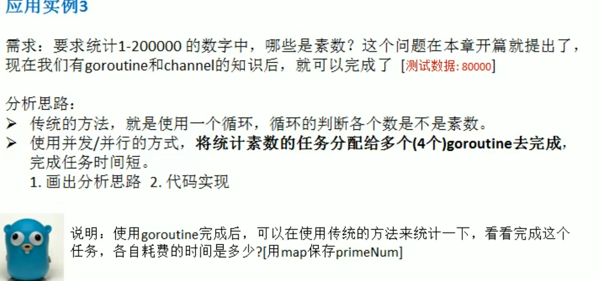
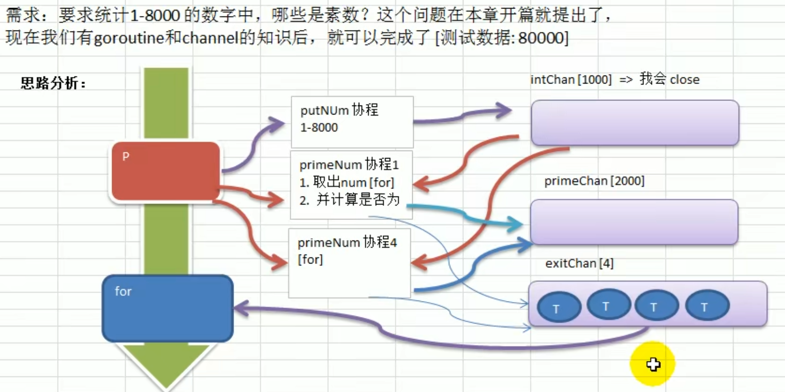

# 协程管道综合案例

## 实例一



```go
package main
import (
	"fmt"
)
func writeData(intChan chan int) {
	for i := 1; i <= 50; i++ {
		intChan <- i
	}
	close(intChan)
}
func readData(intChan chan int, exitChan chan bool) {
	for {
		v, ok := <-intChan
		if !ok {
			break
		}
		fmt.Printf("readData,读到数据：=%v\n", v)
	}
	exitChan <- true
	close(exitChan)
}
func main() {
	var intChan chan int
	intChan = make(chan int, 50)
	exitChan := make(chan bool, 1)
	go writeData(intChan)
	go readData(intChan, exitChan)
	for {
		_, ok := <-exitChan
		if !ok {
			break
		}

	}
}
```




## 练习



```go
package main
import (
	"fmt"
	"sync"
)
func writeData(numChan chan int) {
	for i := 1; i <= 2000; i++ {
		numChan <- i
	}
	close(numChan)
}
func readData(numChan chan int, resChan chan int, wg *sync.WaitGroup) {
	defer wg.Done()
	for v := range numChan {
		sum := 0
		for i := 1; i <= v; i++ {
			sum += i
		}
		resChan <- sum
	}
}
func main() {
	var intChan chan int
	intChan = make(chan int, 2000)
	resChan := make(chan int, 2000)

	var wg sync.WaitGroup
	go writeData(intChan)
	//添加八个协程

	for i := 1; i <= 8; i++ {
		wg.Add(1)
		go readData(intChan, resChan, &wg)
	}
	//等待每个协程都完成
	go func() {
		wg.Wait()
		close(resChan)
	}()

	i := 1
	for v := range resChan {
		fmt.Printf("res[%v]=%v", i, v)
		i++
	}
}
```


## 实例三





代码:

```go
package main

import (
	"fmt"
	"sync"
)

func isPrime(n int) bool {
	if n <= 1 {
		return false
	}
	if n <= 3 {
		return true
	}
	if n%2 == 0 || n%3 == 0 {
		return false
	}
	for i := 5; i*i <= n; i += 6 {
		if n%i == 0 || n%(i+2) == 0 {
			return false
		}
	}
	return true
}

func putNum(intChan chan int) {
	for i := 1; i <= 8000; i++ {
		intChan <- i
	}
	close(intChan)
}
func primeNum(intChan chan int, resChan chan int, wg *sync.WaitGroup) {
	defer wg.Done()
	for v := range intChan {
		if isPrime(v) {
			resChan <- v
		}
	}
}
func main() {
	var intChan chan int
	intChan = make(chan int, 1000)
	resChan := make(chan int, 2000)

	var wg sync.WaitGroup
	go putNum(intChan)
	//添加八个协程

	for i := 1; i <= 4; i++ {
		wg.Add(1)
		go primeNum(intChan, resChan, &wg)
	}
	//等待每个协程都完成
	go func() {
		wg.Wait()
		close(resChan)
	}()
	for v := range resChan {
		fmt.Printf("素数为：%v\n", v)

	}
}

```

视频中的代码：

```go
package main

import (
	"fmt"
	"time"
)

func isPrime(n int) bool {
	if n <= 1 {
		return false
	}
	if n <= 3 {
		return true
	}
	if n%2 == 0 || n%3 == 0 {
		return false
	}
	for i := 5; i*i <= n; i += 6 {
		if n%i == 0 || n%(i+2) == 0 {
			return false
		}
	}
	return true
}

func putNum(intChan chan int) {
	for i := 1; i <= 8000; i++ {
		intChan <- i
	}
	close(intChan)
}
func primeNum(intChan chan int, resChan chan int, exitChan chan bool) {
	for {
		time.Sleep(time.Millisecond * 10)
		num, ok := <-intChan
		if !ok {
			break
		}
		if isPrime(num) {
			resChan <- num
		}
	}
	fmt.Println("一个协程完成取不到数据而退出")
	exitChan <- true
}
func main() {
	var intChan chan int
	intChan = make(chan int, 1000)
	resChan := make(chan int, 2000)
	exitChan := make(chan bool, 4)

	go putNum(intChan)
	//添加八个协程

	for i := 1; i <= 4; i++ {
		go primeNum(intChan, resChan, exitChan)
	}
	//等待每个协程都完成
	go func() {
		for i := 1; i <= 4; i++ {
			<-exitChan
		}
		close(resChan)
	}()
	for v := range resChan {
		fmt.Printf("素数为：%v\n", v)

	}
}

```

