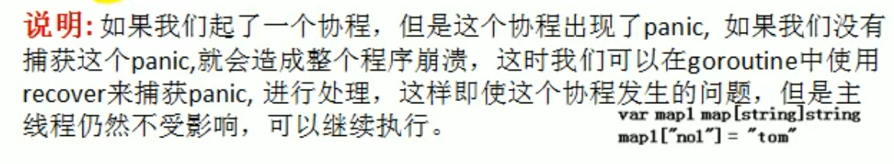

# channel使用细节和注意事项

## 1. 管道可以声明为只读或只写

设置管道只读或者只写：

```go
var chan1 chan<- int
chan1 = make(chan int,2)
chan1<-1
//num := <-chan1 这时候会报错

var chan2 <-chan int
num1 := <-chan2
// chan2<- 3 此时会报错
```

## 2. 使用select可以解决从管道取数据的阻塞问题

```go
package main
import (
	"fmt"
)
func main() {
	//使用select解决从管道取数据的阻塞问题
	intChan := make(chan int, 10)
	for i := 0; i < 10; i++ {
		intChan <- i
	}
	stringChan := make(chan string, 5)
	for i := 0; i < 5; i++ {
		stringChan <- "hello" + fmt.Sprintf("%d", i)
	}
	//不确定什么时候关闭管道的时候可以使用select
	for {
		select {
		case v := <-intChan:
			fmt.Printf("从intChan读取的数据%d\n", v)
		case v := <-stringChan:
			fmt.Printf("从stringChan读取的数据%v\n", v)
		default:
			//time.Sleep(time.Second)
			fmt.Println("都取不到了")
			return
		}
	}
}
```


## 3. goroutine中使用recover,解决协程中出现的panic,导致程序崩溃的问题



```go
package main
import (
	"fmt"
	"time"
)
func sayHello() {
	for i := 0; i < 10; i++ {
		time.Sleep(time.Second)
		fmt.Println("hello world")
	}
}
func test() {
	//使用错误处理解决defer+recover
	defer func() {
		if err := recover(); err != nil {
			fmt.Println("test()发生错误", err)
		}
		
	}()

	var myMap map[int]string
	myMap[0] = "golang"
}
func main() {
	go sayHello()
	go test()
	for i := 0; i < 10; i++ {
		time.Sleep(time.Second)
		fmt.Println("main() ok,", i)
	}
}
```

网络编程，go mod ，反射，context
