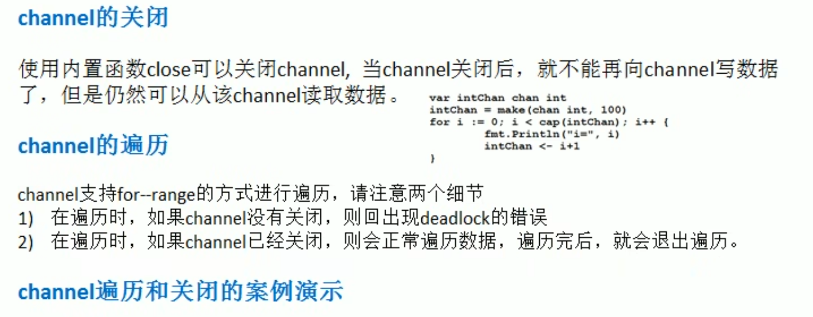

# 管道的关闭和遍历



## 关闭

```go
package main

import "fmt"

func main() {
	intChan := make(chan int, 3)
	intChan <- 100
	intChan <- 200
	close(intChan)
	//intChan <- 300
	//读数据
	m1 := <-intChan
	fmt.Println(m1)
}

```

以上代码，在关闭管道后，即使还有空间但也无法继续添加数据，还是可以进行读数据


## 遍历

```go
//遍历管道
intChan2 := make(chan int, 100)
for i := 0; i < 100; i++ {
    intChan2 <- i * 2
}
close(intChan2)
for v := range intChan2 {
    fmt.Println("v=", v)
}
```

遍历管道之前必须要关闭管道