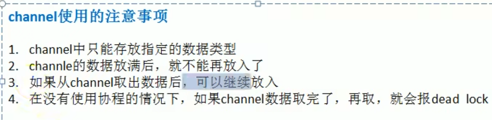
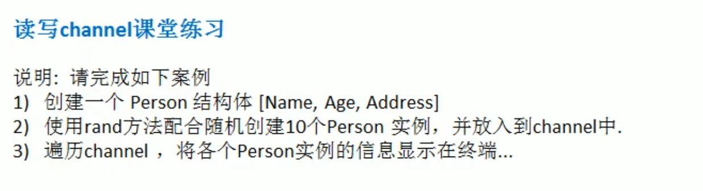

# channel使用的注意事项



**在管道类型是空接口类型的时候，例如取出的空接口的结构体时候需要类型断言**

```go
package main
import "fmt"
type Cat struct {
	Name string
	Age  int
}
func main() {
	var allChan chan interface{}
	allChan = make(chan interface{}, 3)

	allChan <- 10
	allChan <- "tom jack"
	cat := Cat{"小花猫", 4}
	allChan <- cat
	<-allChan
	<-allChan
	newCat := <-allChan
	fmt.Printf("newCat类型是：%T,newCat=%v", newCat, newCat)
	//需要类型断言才能够输出对象的值
	fmt.Println(newCat.(Cat).Name)
}

```


## 练习




代码部分：

```go
package main

import (
	"fmt"
	"math/rand"
)

// Person 结构体
type Person struct {
	Name    string
	Age     int
	Address string
}

func main() {
	// 创建一个能存放 Person 结构体的 channel，长度为 10
	personChan := make(chan Person, 10)

	// 随机生成 10 个 Person 实例并放入 channel
	for i := 0; i < 10; i++ {
		p := Person{
			Name:    fmt.Sprintf("Person%d", i),
			Age:     rand.Intn(100), // 随机年龄，范围 0-99
			Address: fmt.Sprintf("Address%d", i),
		}
		personChan <- p
	}
    //关闭管道
	close(personChan)
	// 遍历 channel，显示 Person 实例信息
	for p := range personChan {
		fmt.Printf("Name: %s, Age: %d, Address: %s\n", p.Name, p.Age, p.Address)
	}
}

```

