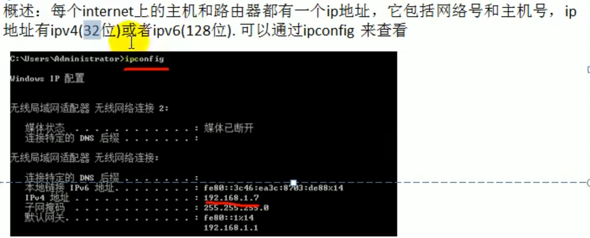
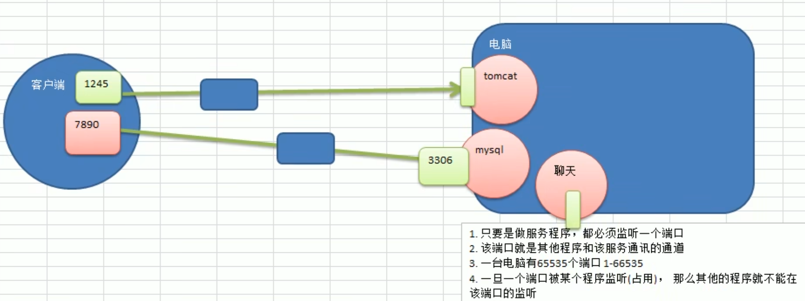
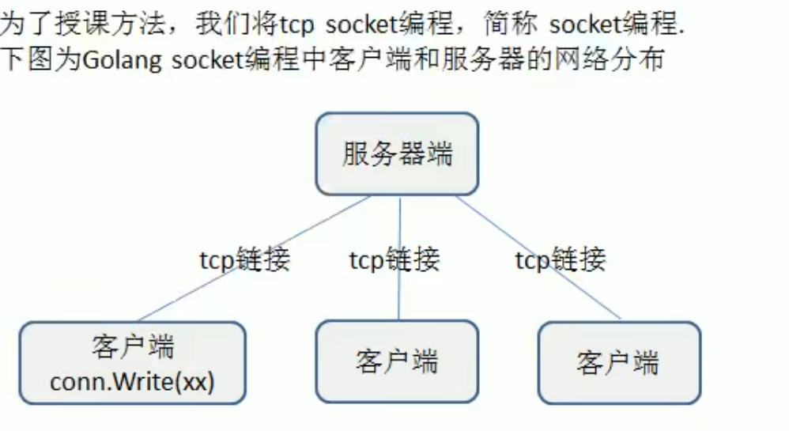

# ip地址

# 端口（port）介绍

我们这里所指的端口不是指物理意义上的端口，而是特指TCP/IP协议中的端口，是逻辑意义上的端口。

如果把IP地址比作一间房子，端口就是出入这间房子的门。真正的房子只有几个门，但是一个IP地址的端口可以有65536（即：256×256）个之多！端口是通过端口号来标记的，端口号只有整数，范围是从0到65535（256×256-1）

**端口(port)-分类**

1. 0号端口：保留端口

2. 1-1024号端口：固定端口（有名端口）

   又叫有名端口，即被某些程序固定使用，一般程序员不使用

   示例：

   22: SSH远程登录协议 	23: telnet使用

   21: ftp使用	25: smtp服务使用	

   80: iis使用	7: echo服务

3. 1025-65535号端口：动态端口

   这些端口，程序员可以使用这些端口

**端口(port)-使用注意**

1. **最小化开放原则**：在计算机（尤其是服务器）上应尽可能少开放端口
2. **独占监听原则**：一个端口同一时间只能被一个程序监听
3. **端口监控方法**：使用命令 `netstat -an` 查看本机正在监听的端口
4. **安全排查方法**：
   - 使用 `netstat -anb` 查看监听端口对应的程序PID
   - 结合任务管理器关闭不安全的端口

（注：`netstat -anb` 需要管理员权限执行）

# tcp socket编程的客户端和服务器端

