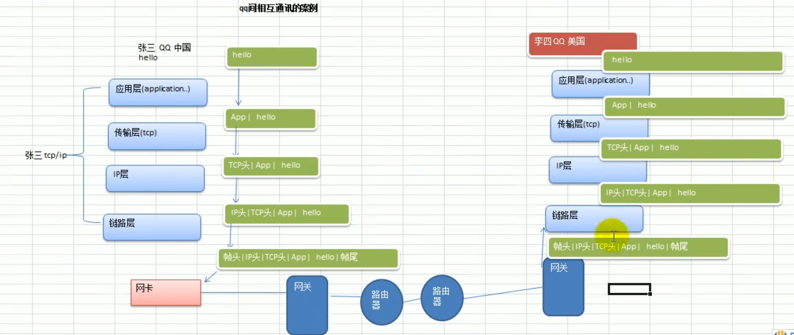

# 网络编程基本介绍

**Golang的主要设计目标**之一就是面向大规模后端服务程序，网络通信是服务端程序必不可少也是至关重要的一部分。

**网络编程有两种**：
1）**TCP socket编程**，是网络编程的主流。之所以叫TCP socket编程，是因为底层是基于TCP/IP协议的。比如：QQ聊天 [示意图]
2）**B/S结构的HTTP编程**，我们使用浏览器去访问服务器时，使用的就是HTTP协议，而HTTP底层依旧是用TCP socket实现的。[示意图] 比如：京东商城 【这属于Go Web开发范畴】

# 网络编程基本知识

## 网线，网卡，无线网卡

## 协议

TCP/IP（Transmission Control Protocol/Internet Protocol）的简写，中文译名为传输控制协议/因特网互联协议，又叫网络通讯协议，这个协议是Internet最基本的协议、Internet国际互联网络的基础，简单地说，就是由网络层的IP协议和传输层的TCP协议组成的。

一个关于QQ的案例

