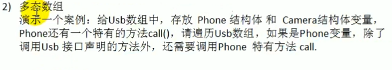

# 多态

变量或者实例具有多种形态，多态特征通过接口实现

```go
package main
import "fmt"
type Usb interface {
	Start()
	Stop()
}

type Camera struct {
}
type Phone struct {
}

type Computer struct {
}

func (c Camera) Start() {
	fmt.Println("相机开始工作")
}
func (c Camera) Stop() {
	fmt.Println("相机停止工作")
}
func (p Phone) Start() {
	fmt.Println("手机开始工作")
}
func (p Phone) Stop() {
	fmt.Println("手机开始工作")
}
func (computer Computer) Working(u Usb) {
	u.Start()
	u.Stop()
}
func main() {
	computer := Computer{}
	phone := Phone{}
	camera := Camera{}
	computer.Working(phone)
	computer.Working(camera)
}
```

对于以上的代码中，USB可以是Phone类型也可以是Camera类型，这就是多态的体现



代码实现：

```go
func main() {
	var usbArr [3]Usb
	usbArr[0] = Phone{"小米"}
	usbArr[1] = Phone{"vivo"}
	usbArr[2] = Camera{"索尼"}
	fmt.Println(usbArr)
}
```

上述主要是实现一个多态数组，里面可以同时存放Phone和Camera类型的数据，其他代码部分是在第一段代码中