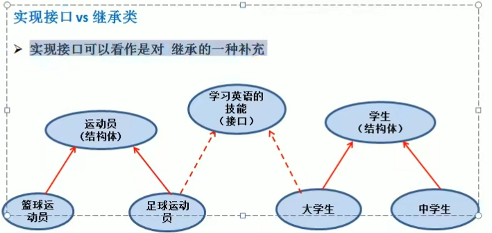

# 实现接口VS继承类 



下面是代码实现：

```go
package main
import "fmt"
type StudyEnglish interface {
	SpeakEnglish() string
}

type Athlete struct {
	Name string
}
type Student struct {
	Name string
}
type BasketballAthlete struct {
	Athlete
}
type FootballAthlete struct {
	Athlete
}
type CollageStudent struct {
	Student
}
type MiddleStudent struct {
	Student
}

func (b BasketballAthlete) SpeakEnglish() string {
	return b.Name + "说 I can play basketball"
}
func (c CollageStudent) SpeakEnglish() string {
	return c.Name + "说 I need study English"
}
func showEnglish(s StudyEnglish) {
	fmt.Println(s.SpeakEnglish())
}
func main() {
	b := BasketballAthlete{
		Athlete{
			"小明",
		},
	}
	c := CollageStudent{
		Student{
			"小刚",
		},
	}
	showEnglish(b)
	showEnglish(c)
}

```

1. 接口和继承解决的解决的问题不同 
   1. 继承的价值主要在于:解决代码的复用性和可维护性。 
   2. 接口的价值主要在于：设计，设计好各种规范(方法)，让其它自定义类型去实现这些方法。 

2. 接口比继承更加灵活 
   1. 接口比继承更加灵活，继承是满足 is - a的关系，而接口只需满足 like- a的关系。 

3. 接口在一定程度上实现代码解耦