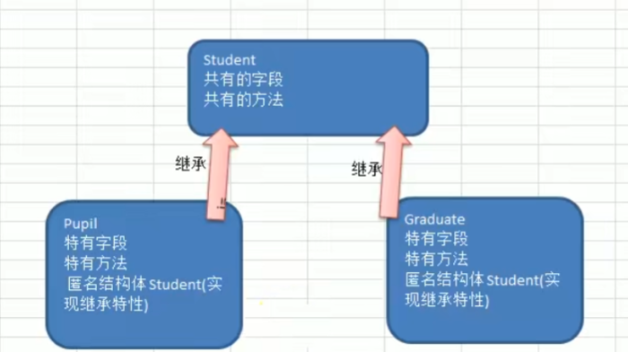
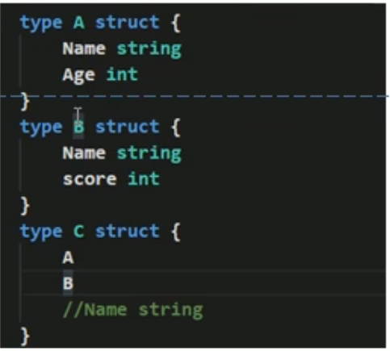

# 继承

1. 引出继承

   1. 当两个乃至多个结构体的字段和方法几乎相同，想要构造结构体以及实现方法，要编写几乎相同的几段代码

   2. 会出现代码冗余，不利于代码维护，以及不利于功能的扩展
   3. 通过继承的方式来解决代复用的问题

2. 继承的基本概念

   1. 当多个结构体存在相同的属性(字段)和方法时,可以从这些结构体中抽象出结构体(比如刚才的Student)，在该结构体中定义这些相同的属性和方法。

   2.  其它的结构体不需要重新定义这些属性和方法,只需嵌套一个Student匿名结构体即可。
   3. 也就是说:在Golang中,如果一个struct嵌套了另一个匿名结构体,那么这个结构体可以直接访问匿名结构体的字段和方法，从而实现了继承特性。

​	

3. 继承的基本语法

   ```go
   type Goods struct {
       Name string
       Price int
   }
   type Book struct {
       Goods //这里就是嵌套了匿名结构体Goods
       Writer string
   }
   ```

4. 继承的案例：简单的成绩系统

   ```go
   package main
   import "fmt"
   type Student struct {
   	Name  string
   	Age   int
   	Score int
   }
   func (S *Student) ShowInfo() {
   	fmt.Printf("学生名=%v 年龄=%v 成绩=%v", S.Name, S.Age, S.Score)
   }
   func (S *Student) SetScore(score int) {
   	S.Score = score
   }
   // 小学生
   type Pupil struct {
   	Student
   }
   func (P *Pupil) testing() {
   	fmt.Println("小学生正在考试。。。")
   }
   // 大学生
   type Graduate struct {
   	Student
   }
   func (G *Graduate) testing() {
   	fmt.Println("大学生正在考试。。。")
   }
   func main() {
   	pupil := &Pupil{}
   	pupil.Student.Name = "tom"
   	pupil.Student.Age = 7
   	pupil.testing()
   	pupil.Student.SetScore(69)
   	pupil.Student.ShowInfo()
   	fmt.Println()
   	
   	Graduate := &Graduate{}
   	Graduate.Student.Name = "kangkang"
   	Graduate.Student.Age = 19
   	Graduate.testing()
   	Graduate.Student.SetScore(60)
   	Graduate.Student.ShowInfo()
   }
   ```

   

---

# 继承的深入讨论

1. 结构体可以使用嵌套匿名结构体所有的字段和方法，即，首字母大小写的字段、方法都可以使用

2. 匿名结构体字段可以简化，直接对象名.属性或者方法

3. 当结构体和匿名结构体有相同的字段或者方法时，编译器采用就近访问原则访问，如希望访问匿名结构体的字段和方法，可以通过匿名结构体名来区分

   例如A中有name,B继承A,又在B中定义一个name,如果给b的name赋值，则调用的实际上是B中的name

4. 结构体嵌入两个(或多个)匿名结构体,如两个匿名结构体有相同的字段和方法(同时结构体本身没有同名的字段和方法),在访问时,就必须明确指定匿名结构体名字,否则编译报错。

​	

5. 如果一个struct嵌套了一个有名的结构体，这种模式就是组合，如果是组合关系，那么在访问组合的结构体的字段或者方法时，必须带上结构体的名字

   ```go
   type A struct {
       Name string
   }
   //组合
   type D struct{
       a A
   }
   ```

   