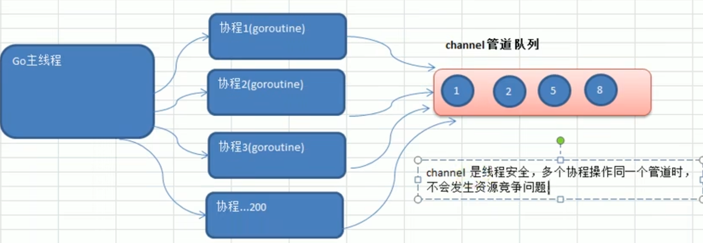
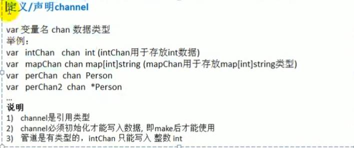
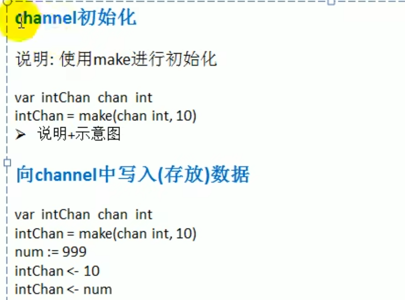

#   管道(channel)-基本介绍

1. 前面使用全局变量加锁同步来解决 goroutine 的通讯，但不完美
2. 主线程在等待所有 goroutine 全部完成的时间很难确定，我们这里设置 10 秒，仅仅是估算。
3. 如果主线程休眠时间长了，会加长等待时间，如果等待时间短了，可能还有 goroutine 处于工作状态，这时也会随主线程的退出而销毁
4. 通过全局变量加锁同步来实现通讯，也并不利用多个协程对全局变量的读写操作。
5. 上面种种分析都在呼唤一个新的通讯机制 - channel

## channel的介绍

1. channle 本质就是一个数据结构 - 队列【示意图】
2. 数据是先进先出
3. 线程安全，多 goroutine 访问时，不需要加锁，就是说 channel 本身就是线程安全的
4. channel 时有类型的，一个 string 的 channel 只能存放 string 类型数据。




## 管道的基本用法

### 管道的声明：



### 管道的初始化



```go
package main
import "fmt"
func main() {
	//创建一个可以存放是哪个int类型的管道
	var intChan chan int
	intChan = make(chan int, 3)
	fmt.Printf("intChan的值为：%v,intChan本身的地址：%p\n", intChan, &intChan)
	//写入数据
	intChan <- 10
	num := 211
	intChan <- num
	//查看管道的长度和cap()容量
	fmt.Printf("channel len=%v,cap=%v\n", len(intChan), cap(intChan))
	//向管道内写入数据时，不能超出容量
	intChan <- 50
	fmt.Printf("channel len=%v,cap=%v\n", len(intChan), cap(intChan))
	//从管道中取数据,如果管道中已经没有数了，再取就会报错
	var num2 int
	num2 = <-intChan
	fmt.Printf("num2=%v\n", num2)
	fmt.Printf("channel len=%v,cap=%v\n", len(intChan), cap(intChan))

}
```

