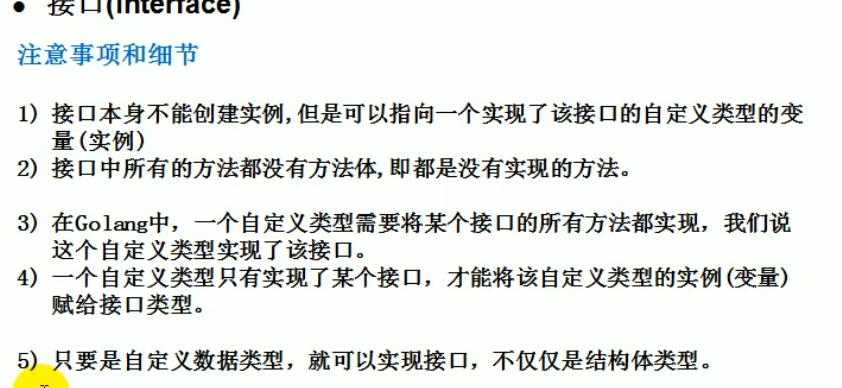
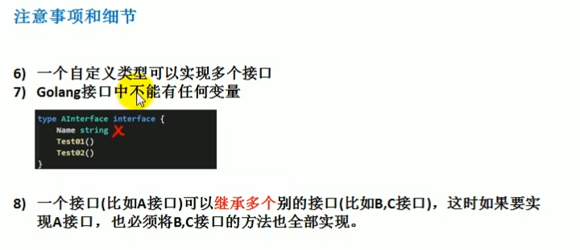
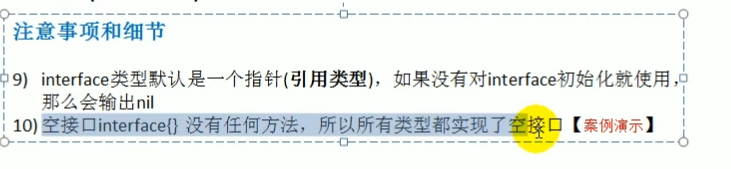

# 接口interface

Golang中的多态是由接口来体现的

1. 接口的基本概念：

   1. 基本介绍：

      interface类型可以定义一组方法，但是这些不需要实现。并且interface不能包含任何变量，到定义某个自定义类型要使用的时候，再根据具体情况吧方法写出来。

    2. 基本语法：

       ```go
       type 接口名 interface {
           method1(参数列表)返回值列表
           method2(参数列表)返回值列表
           ...
       }
       ```

       实现接口的所有方法：

       ```go
       func (t 自定义类型)method1(参数列表)返回值 {
           //方法实现
       }
       func (t 自定义类型)method2(参数列表)返回值 {
           //方法实现
       }
       ...
       ```

​	接口中的所有方法都没有方法体，即接口的方法都是没有实现的方法，接口体现了程序设计的多态和高内聚和低耦合的思想。

​	这Golang的接口，不需要显示的实现。只需要一个变量，含接口类型中的所有方法，那么这个变量就实现了这个接口。因此，Golang中没有implement这样的关键字

2. 简单的案例：

```go
package main
import "fmt"
type Usb interface {
	Start()
	Stop()
}
type Camera struct {
}
type Phone struct {
}

type Computer struct {
}

func (c Camera) Start() {
	fmt.Println("电脑开始工作")
}
func (c Camera) Stop() {
	fmt.Println("电脑停止工作")
}
func (p Phone) Start() {
	fmt.Println("手机开始工作")
}
func (p Phone) Stop() {
	fmt.Println("手机开始工作")
}
func (computer Computer) Working(u Usb) {
	u.Start()
	u.Stop()
}
func main() {
	computer := Computer{}
	phone := Phone{}
	camera := Camera{}
	computer.Working(phone)
	computer.Working(camera)
}

```


# 接口注意事项







# 接口的一个实例

``` go
package main

import (
	"fmt"
	"math/rand"
	"sort"
)

type Hero struct {
	Name string
	Age  int
}
type heroSlice []Hero

func (hs heroSlice) Len() int {
	return len(hs)
}
func (hs heroSlice) Less(i, j int) bool {
	return hs[i].Age < hs[j].Age
}
func (hs heroSlice) Swap(i, j int) {
	//fmt.Println(i, j)
	//temp := hs[i]
	//hs[i] = hs[j]
	//hs[j] = temp
	//可以简化为下面的
	hs[i], hs[j] = hs[j], hs[i]
}

// 不能直接创建实例
func main() {
	var intSlice = []int{10, -2, 36, 34, 5}
	//对上面的切片进行排序
	//可以用一些排序算法，例如冒泡排序。。。
	//系统方法sort
	sort.Ints(intSlice)
	fmt.Println(intSlice)

	var hs = heroSlice{}
	for i := 0; i < 10; i++ {
		hero := Hero{
			Name: fmt.Sprintf("英雄%d", rand.Intn(100)),
			Age:  rand.Intn(100),
		}
		hs = append(hs, hero)
	}

	//遍历切片，排序前
	for _, v := range hs {
		fmt.Println(v)
	}
	sort.Sort(hs)
	//排序后遍历结果
	fmt.Println("--------------------------")
	for _, v := range hs {
		fmt.Println(v)
	}
}

```

以上是实现一个Hero切片类型的排序，使用了系统方法中的Sort这个函数，传入的参数是一个interface接口类型的数据，需要实现Len(),Less()以及Swap()三个方法，才能够去调用
